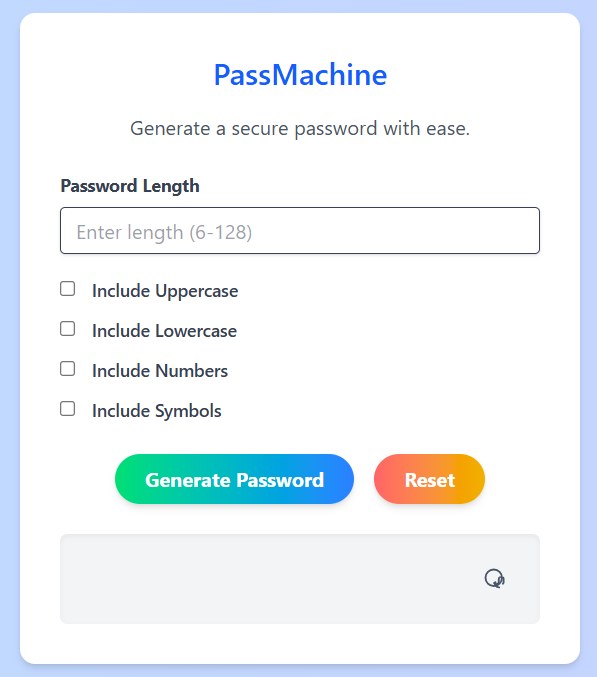

# PassMachine 🔐

PassMachine is a simple yet powerful password generator built using HTML, CSS, and JavaScript.

It allows users to customize the length and character types in their passwords, making it suitable for various security needs.

---

## Features 🚀

- Generate passwords of customizable length (6-128)
- Include uppercase, lowercase, numbers, and symbols
- Reset form with one click
- Responsive design with modern UI

---

## How to Use 💡

1. Enter your desired password length.
2. Select the character types you want to include.
3. Click on "Generate Password" to get a secure password.
4. Use the "Reset" button to clear selections.

## 📸 Screenshot

